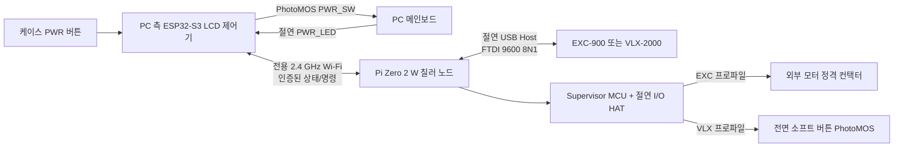

# Koolance EXC-900 / VLX-2000 무선 PC 인터록 제어기 설계

- 작성일: 2026-07-24
- 상태: 승인된 대화형 설계를 문서화함; 구현 계획 전 문서 검토 대기
- 대상 장치: Koolance EXC-900-110V/220V, VLX-2000-110V
- KSM 변형: `f.3C`
- UI 프로토타입: [koolance-controller-ui.html](../../ui/koolance-controller-ui.html)
- 프로토콜 기준: `KSM Communication Protocol v3.0`, 문서 버전 1.3.1, 2026-01-28

## 1. 목표

칠러와 PC 사이의 거리를 2.4 GHz Wi-Fi로 연결하고 다음 기능을 제공한다.

1. 3.5인치 LCD에서 칠러 상태, PC 상태, 이슬점과 경보를 실시간 표시한다.
2. 로터리 엔코더와 물리 버튼으로 목표 온도, 펌프 단계, KSM 알람/릴레이 및 PC 인터록 기준을 조정한다.
3. 냉각수 온도, 유량, 펌프 RPM, 수위/센서 상태와 통신 상태가 모두 정상일 때만 PC를 켠다.
4. PC의 케이스 전원 버튼을 제어기가 중계하여 예냉 인터록을 우회할 수 없게 한다.
5. PC 종료 후 칠러를 기본 5분간 후행 운전하고, 이 시간 중 재기동 요청이 오면 칠러 정지를 취소한다.
6. EXC-900의 하드 전원 스위치와 VLX-2000의 소프트 전원 버튼을 동일한 시스템에서 설치 프로파일로 선택해 지원한다.

## 2. 안전 및 범위 원칙

- PC 기동 전에는 강제 인터록을 적용한다.
- PC 운전 중 냉각 이상, 통신 두절 또는 결로 위험이 발생해도 PC를 자동 종료하거나 강제 종료하지 않는다. LCD, 경고 LED와 버저만 작동한다.
- PWR_LED 점멸은 절전 상태로 간주하며 칠러 운전을 유지한다.
- 상태가 불명확하거나 통신이 끊긴 경우 칠러 OFF 명령을 내리지 않는다.
- 결로 보호는 감시 전용이다. 사용자는 이슬점 이하의 목표 온도를 선택할 수 있으며 제어기는 경고만 낸다.
- 커스텀 PCB는 SELV 저전압만 취급한다. EXC의 AC 경로는 외부 인증 컨택터와 보호장치 안에서 처리한다.
- AC 배선과 컨택터 선정·시공은 장비 명판과 현지 전기 규정에 따라 자격을 갖춘 작업자가 수행한다.
- 외부 PC 또는 모바일 클라이언트에는 KSM/COM 제어 포트를 공개하지 않는다.

## 3. 전체 구조

PC 측 ESP32-S3가 전체 전원 상태 머신과 사용자 설정을 소유한다. Pi 노드는 USB/KSM 통신과 모델별 전원 인터페이스를 소유한다. 원시 COM 바이트를 무선으로 투명 터널링하지 않고, Pi가 파싱·검증한 상태와 고수준 명령만 교환한다.

## 4. 하드웨어 설계

### 4.1 PC 측 LCD 제어기

| 블록 | 설계 |
|---|---|
| MCU | ESP32-S3-WROOM 계열, 16 MB Flash와 8 MB PSRAM 권장 |
| LCD | 3.5인치 480×320 IPS, ST7796S 계열, 8-bit 8080 병렬 인터페이스 |
| 입력 | 로터리 엔코더+누름, PC POWER, BACK, BUZZER MUTE, 케이스 PWR 버튼 입력 |
| 환경 센서 | SHT45급 온습도 센서. PC와 냉각 부품 주변 공기를 대표하는 통풍 위치에 배치 |
| 알림 | 트랜지스터 구동 능동 버저와 별도 경고 LED |
| 설정 저장 | 버전과 CRC를 가진 이중 NVS 슬롯. 두 슬롯이 모두 손상되면 PC 기동 기능 비활성 |
| 전원 | PC와 독립된 인증 5 V 어댑터, 3 A 권장. 입력 PTC/퓨즈, TVS와 역극성 보호 |

#### PC PWR 버튼 경로

케이스 전원 버튼은 메인보드에서 분리하여 제어기 입력으로 연결한다. 제어기는 준비 상태에 따라 극성 없는 PhotoMOS 접점을 통해 메인보드 `PWR_SW` 핀을 단락한다.

- 케이스 버튼 입력은 무전압 접점이며 RC 필터와 소프트웨어 디바운스를 적용한다.
- `PWR_SW` 출력은 메인보드와 갈바닉 절연한다.
- PC가 이미 켜진 상태에서 케이스 버튼을 누르면 누름 길이를 메인보드에 전달한다.
- 제어기 고장 시 유지보수를 위한 물리적 바이패스 헤더를 둔다. 바이패스는 예냉 인터록을 무력화하므로 서비스 전용으로 표시한다.
- LCD의 PC POWER 버튼은 대기 상태에서 예냉을 시작하고, 운전 상태에서는 1초 길게 눌러야 메인보드에 전원 버튼 신호를 보낸다.

#### PC PWR_LED 감지

메인보드 PWR_LED의 극성과 구동 전압 차이를 흡수하기 위해 브리지 정류기, 전류 제한과 옵토커플러를 사용한다.

- 연속 점등: PC ON
- 점멸: 절전, PC ON과 동일하게 취급
- 8초 동안 입력 펄스가 전혀 없음: PC OFF
- 배선 단선은 PC OFF처럼 보일 수 있으므로 기동 직후 상태 변화 타임아웃과 진단 화면을 함께 사용한다.

### 4.2 칠러 측 Pi Zero 2 W 노드

| 블록 | 설계 |
|---|---|
| 컴퓨터 | Raspberry Pi Zero 2 W, 내장 2.4 GHz Wi-Fi |
| 저장장치 | 고내구성 microSD, 읽기 전용 root, tmpfs 런타임 파일, 제한된 순환 로그 |
| USB | OTG Host, Linux `ftdi_sio`, `/dev/serial/by-id` 경로 사용 |
| USB 절연 | ADuM3160급 Full-Speed 절연, 절연 DC/DC, VBUS 전류 제한과 ESD 보호 |
| I/O HAT | Supervisor MCU, PAIR/RESET 버튼, 상태 LED, EXC/VLX 절연 출력과 피드백 입력 |
| 전원 | 독립 인증 5 V/3 A 어댑터, brownout 감지 |

USB Full-Speed는 9600 bps KSM 통신에 충분하다. USB 절연은 칠러와 제어기 전원 사이의 접지 루프를 차단한다.

### 4.3 Supervisor MCU

Pi HAT에 ATtiny1616급 소형 MCU를 두어 Linux 재부팅과 GPIO 초기화의 영향을 물리 출력에 전달하지 않는다.

- Pi와 프레임 CRC를 가진 UART 또는 I2C 명령으로 통신한다.
- VLX 전원 버튼 펄스를 정확히 300 ms로 생성한다.
- 동일 명령 ID의 재전송은 물리 출력을 다시 실행하지 않는다.
- Pi 재부팅 중 EXC 컨택터 출력의 기존 상태를 유지한다.
- Wi-Fi 또는 Pi 서비스 heartbeat 손실만으로 출력 상태를 바꾸지 않는다.
- Pi 노드의 5 V 전원이 완전히 소실되면 일반 NO 컨택터는 해제될 수 있다. 완전 전원 상실 중에도 EXC 전원을 유지해야 하는 설치에서는 장비 명판에 맞는 기계식 유지형 컨택터 또는 코일 백업 전원을 외부 전기 설계에 적용한다.

### 4.4 EXC-900 전원 인터페이스

EXC 본체의 하드 스위치를 ON 위치로 두고 외부 컨택터로 AC 공급을 제어한다.

- HAT은 컨택터의 12/24 V DC 코일 회로를 무전압 절연 접점으로만 제어한다.
- 컨택터는 압축기/모터 부하용 정격을 사용한다.
- 연속 전류 정격은 장비 명판 전류의 125% 이상이고, 제조사가 요구하는 기동전류를 수용해야 한다.
- 보조접점을 HAT 절연 입력으로 되읽어 실제 투입 상태를 확인한다.
- AC 차단기, 누전 보호와 배선 굵기는 현지 규정과 장비 매뉴얼을 따른다.

### 4.5 VLX-2000 소프트 전원 인터페이스

VLX의 AC 입력은 상시 공급하고 전면 전원 버튼을 절연 PhotoMOS로 병렬 구동한다.

접근 순서는 다음과 같다.

1. 전면 버튼 PCB와 메인 PCB 사이 커넥터를 확인하고 비파괴 Y-어댑터 하네스를 우선 설계한다.
2. 하네스 방식이 불가능하면 전원을 분리한 상태에서 버튼 패드와 배선을 추적한다.
3. 자격을 갖춘 작업자가 절연 계측기로 대기 전압, 극성, 누름 파형과 접지 관계를 측정한다.
4. 단순 접점이면 버튼 양단에 PhotoMOS를 병렬 연결한다.
5. 키 매트릭스 또는 저항식 입력이면 측정된 임피던스와 파형을 재현하는 전용 인터페이스를 사용한다.
6. 원래 버튼 기능을 보존하고 탈착식 커넥터, 변형 방지, 절연 튜브와 배선 라벨을 적용한다.
7. KSM 응답, 펌프 RPM과 유량으로 전원 상태를 분류한 뒤에만 버튼 펄스를 보낸다.
8. 상태가 불명확하면 토글하지 않고 수동 확인 경보를 표시한다.

### 4.6 모델 프로파일

하드웨어는 두 모델을 동시에 제어하지 않는다. LCD의 전문가 설정에서 `EXC-900` 또는 `VLX-2000`을 선택한다.

- 프로파일 변경은 PWR_LED가 OFF이고 모든 전원 시퀀스가 중지된 상태에서만 가능하다.
- 변경 전에 모든 출력 명령을 중단하고 모델명을 2초간 눌러 확인한다.
- 선택된 프로파일은 부팅 화면과 대시보드에 항상 표시한다.
- EXC와 VLX 출력 커넥터는 서로 바꿔 꽂기 어렵게 별도 키와 라벨을 사용하지만 자동 ID 기능은 사용하지 않는다.

## 5. KSM `f.3C` 통신 설계

### 5.1 시리얼 조건

- 9600 bps, 8 data bits, no parity, 1 stop bit
- flow control 없음
- DTR/RTS 비활성
- raw binary 전송
- 일반 polling 주기: 1초
- Pi의 `ksm-agent`만 포트를 연다.

### 5.2 프레임

- 데이터 요청: `CF 01 08`
- 데이터 응답: 51바이트, STX `3C`, `3D`, `3E` 또는 `3F`, CMD `02`
- 설정 요청: 51바이트, STX `CF`, CMD `04`
- 체크섬: 앞선 바이트의 합 `% 0x64`
- 16-bit 필드는 문서 예제에 따라 big-endian으로 처리한다.
- 설정 요청에는 즉시 응답이 없으므로 후속 polling으로 검증한다.

### 5.3 주요 필드

| 바이트 | 의미 | 처리 |
|---:|---|---|
| 2–3 | LIQ 온도 | 현재 단위의 온도, 오류값 `0x0FAC`, `0x0FA3`, `0x0FA4` 검사 |
| 4–5 | EXT 온도 | 동일 오류값 검사 |
| 6–7 | AMB 온도 | 동일 오류값 검사 |
| 8–9 | 팬 RPM | 0–10,000 RPM |
| 10–11 | 펌프 RPM | 0–10,000 RPM |
| 12–13 | 유량 | raw / 10 LPM 또는 GPM |
| 14–15 | 온도 설정점 | LIQ `T+500`, EXT `T+1000`, LIQ-AMB `T+1500`, EXT-AMB `T+2000` |
| 16–17 | 펌프 단계 | 0=OFF, 1–10 |
| 18–19 | 유량계 | `0x06AE`, INS-FM17/10 mm 고정 |
| 20–43 | 알람/릴레이 | 온도 편차, 유량, 팬/펌프 RPM 임계값 |
| 44–45 | 단위 | `0x0001`=°C/LPM, `0x0002`=°F/GPM |
| 46–47 | 수위 상태 | `0x0001` 정상, `0x0002` 낮음 |
| 48–49 | 수위 동작 | `0x0001`–`0x0004`, OFF/Alarm/Relay 조합 |
| 50 | 체크섬 | `sum(bytes[0..49]) % 0x64` |

### 5.4 설정 쓰기

1. 최신 51바이트 데이터 프레임을 요청한다.
2. 응답 STX, CMD, 길이와 체크섬을 검증한다.
3. 사용자가 선택한 필드만 변경한다.
4. STX를 `CF`, CMD를 `04`로 만들고 체크섬을 재계산한다.
5. 전체 51바이트를 한 번에 전송한다.
6. 다시 polling하여 실제 반영값을 비교한다.
7. 불일치 시 최신 프레임에서 한 번만 재시도한다.
8. 두 번째 검증 실패 시 실제 읽힌 값과 오류를 표시하고 무한 재시도하지 않는다.

센서 오류값이나 체크섬이 잘못된 프레임은 상태 판단과 설정의 기반으로 사용하지 않는다.

## 6. 전용 2.4 GHz Wi-Fi와 페어링

ESP32-S3 제어기가 전용 Wi-Fi AP가 되고 Pi Zero 2 W가 station으로 접속한다. 외부 공유기, DHCP 서버 또는 인터넷에 의존하지 않는다.

### 6.1 초기 페어링

1. LCD에서 페어링을 시작하면 120초 동안 페어링 AP를 연다.
2. Pi HAT의 PAIR 버튼을 눌러야 Pi가 페어링 후보로 나타난다.
3. LCD에 Pi 노드 ID를 표시하고 사용자가 확인한다.
4. 양쪽이 임시 키 교환을 수행하고 고유 WPA2 PSK, 정상 운전 SSID와 256-bit 애플리케이션 키를 저장한다.
5. 페어링 AP를 닫고 정상 전용 AP로 재접속한다.
6. 이후에는 저장된 상대 노드 하나만 허용한다. 새 노드는 양쪽의 물리적 페어링 동작 없이는 등록할 수 없다.

### 6.2 애플리케이션 메시지

TCP 위에 길이 prefix를 가진 CBOR 메시지를 사용하고 AES-256-GCM으로 인증·암호화한다.

공통 필드는 `version`, `message_type`, `session_id`, `sequence`, `command_id`, `monotonic_ms`, `payload`, `authentication_tag`이다.

메시지 유형은 다음과 같다.

- `HELLO`: 버전과 기능 교환
- `HEARTBEAT`: 1초 주기 연결 감시
- `TELEMETRY`: KSM 상태와 출력 상태, 1초 주기
- `COMMAND`: 설정 또는 전원 명령
- `ACK_RESULT`: 명령 수락과 최종 결과
- `EVENT`: 오류, 경보와 재연결 이벤트

상태 변경 명령은 고유 `command_id`를 가진다. 같은 ID를 다시 받으면 물리 출력을 반복하지 않고 저장된 결과만 반환한다. sequence와 session ID로 재전송 공격과 이전 세션 패킷을 거부한다. heartbeat 3회가 누락되면 링크 경보 상태로 전환한다.

## 7. 소프트웨어 구조

### 7.1 ESP32-S3 펌웨어

- `interlock_fsm`: 칠러·PC 전원 상태 머신
- `pc_io`: 케이스 버튼, PWR_SW 출력, PWR_LED 분류
- `link`: AP, pairing, 암호화 메시지와 재접속
- `telemetry_model`: 최신 상태와 데이터 나이 관리
- `alarm_manager`: 경보 우선순위, 버저 패턴과 mute
- `dew_point`: SHT45 보정, 이슬점과 경고 기준 계산
- `ui`: LVGL 화면과 대형 설정 편집기
- `config_store`: 이중 슬롯 NVS, schema version과 CRC
- `diagnostics`: 상대 버전, RSSI, KSM 통계, 최근 이벤트

UI 렌더링이나 네트워크 지연이 PC I/O 처리를 막지 않도록 입력 샘플링과 상태 머신을 별도 FreeRTOS task로 분리하고 watchdog을 적용한다.

### 7.2 Pi 서비스

- `ksm-agent`: USB 검색, polling, f.3C parse/build와 설정 검증
- `link-agent`: pairing, 인증 세션, command deduplication과 telemetry
- `power-agent`: Supervisor MCU 명령과 피드백
- `diagnostics`: USB 재연결 횟수, 체크섬 오류, 서비스 상태와 순환 로그

서비스는 systemd가 관리한다. 비정상 종료 시 자동 재시작하지만 재시작 과정에서 전원 출력을 초기화하거나 토글하지 않는다.

### 7.3 Supervisor 펌웨어

- 부팅 시 출력 핀을 glitch 없이 이전 안전 상태로 복원한다.
- EXC 출력은 명시적인 SET/OFF 명령에서만 변경한다.
- VLX는 허용된 명령 ID마다 한 번만 300 ms 펄스를 생성한다.
- Pi heartbeat 손실은 상태 이벤트로만 기록하고 자동 OFF를 발생시키지 않는다.
- 보조접점 및 PhotoMOS 출력 상태를 Pi에 보고한다.

## 8. 전원 상태 머신

| 상태 | 진입 동작 | 종료 조건 |
|---|---|---|
| `STANDBY` | PC와 칠러 상태 표시, 버튼 대기 | 케이스/LCD PC 기동 요청 |
| `CHILLER_START` | EXC 컨택터 ON 또는 VLX 300 ms 펄스 | KSM과 전원 상태 확인 성공 |
| `PRECOOL` | 칠러 설정 적용, 1초 polling | 준비 조건이 충족되거나 사용자가 취소 |
| `READY_FILTER` | 모든 준비 조건의 연속 시간을 누적 | 10초 연속 정상 또는 한 조건 이탈 |
| `PC_START` | PWR_SW 300 ms 한 번 출력 | 15초 내 PWR_LED 감지 또는 실패 경보 |
| `RUNNING` | PWR_LED ON/점멸 감시, 냉각 이상은 경보만 | PWR_LED가 8초 연속 OFF |
| `POSTRUN` | 칠러를 기본 5분 계속 운전 | 타이머 만료 또는 재기동 요청 |
| `CHILLER_STOP` | 상태 확인 후 EXC OFF 또는 VLX 펄스 | OFF 확인 또는 불명 상태 경보 |
| `RECOVERY` | 재부팅 후 PC/칠러 실제 상태를 재조회 | 일관된 상태가 확인되어 해당 상태로 합류 |

### 8.1 PC 기동 허용 조건

다음 조건이 모두 10초 연속 유지되어야 한다.

1. LIQ 온도 ≤ 사용자가 설정한 PC 시작 허용 온도
2. 유량 ≥ 사용자가 설정한 최소 유량
3. 펌프 RPM ≥ 사용자가 설정한 최소 RPM
4. 수위 정상
5. LIQ/EXT/AMB 센서 오류값 없음
6. 유효한 KSM 프레임의 나이가 2.5초 이하
7. Wi-Fi link 정상

시작 온도, 최소 유량과 최소 RPM은 최초 설치 마법사에서 명시적으로 저장해야 한다. 저장 전에는 PC 자동 기동을 허용하지 않는다.

### 8.2 버튼 동작

- `STANDBY`: 케이스 버튼 짧은 누름은 예냉 시작
- `PRECOOL`: 케이스 버튼 재입력은 기동 취소 후 후행 운전
- `RUNNING`: 케이스 버튼 누름 길이를 메인보드에 전달
- LCD PC POWER: 기동 요청, 운전 중에는 1초 길게 눌러 종료 요청 전달
- BACK: 편집 취소 또는 이전 화면, 길게 누르면 대시보드
- BUZZER MUTE: 현재 경보만 음소거. 새로운 경보가 생기면 다시 울림

### 8.3 후행 운전

- 기본값 5분
- 설정 범위 0–60분, 1분 단위
- 후행 중 PC 기동 요청이 들어오면 칠러 정지를 취소하고 `PRECOOL` 또는 `READY_FILTER`로 이동
- 후행 중 통신이 끊기면 OFF 명령을 보류하고 경보

## 9. 경보 정책

| 경보 | 기동 전 | PC 운전 중 |
|---|---|---|
| 고온/목표 미도달 | 기동 차단 | 표시·버저만 |
| 저유량 | 기동 차단 | 표시·버저만 |
| 저 RPM | 기동 차단 | 표시·버저만 |
| 수위 이상 | 기동 차단 | 표시·버저만 |
| 센서 open/short/out-of-range | 기동 차단 | 표시·버저만 |
| 이슬점 위험 | 경고만, 기동 허용 | 경고만 |
| Wi-Fi/KSM 두절 | 기동 차단 | 표시·버저만, PC/칠러 전원 조작 금지 |
| VLX 상태 불명 | 전원 토글 금지 | 표시·버저만 |

경보 화면에는 원인, 현재값, 기준값, 지속 시간, Wi-Fi/KSM 상태를 표시한다.

## 10. UI 설계

독립 실행 가능한 화면 프로토타입은 [docs/ui/koolance-controller-ui.html](../../ui/koolance-controller-ui.html)에 있다.

### 10.1 가독성

- 실제 LCD 비율 480×320
- 본문 최소 14 px
- 상태와 버튼 라벨 18 px 이상
- 핵심 측정값 24–64 px
- 한 화면의 설정 목록은 최대 4개
- 목표 온도와 펌프 단계는 한 화면에서 한 값만 편집
- 색상 외에도 텍스트와 아이콘으로 상태를 구분

### 10.2 화면

1. 대시보드 1: LIQ 온도, 목표 온도, 유량, 펌프 RPM, PC 상태
2. 대시보드 2: 이슬점, 실내 온습도, 수위, 링크 품질, 후행 시간
3. 예냉: 준비 조건별 현재값과 통과 상태, 10초 안정 진행
4. 경보: 원인, 현재값, 기준값, 지속 시간과 mute 상태
5. 설정 카테고리: 칠러, PC 인터록, KSM 알람/릴레이, 시스템
6. 단일 값 편집: 큰 숫자, 허용 범위, 단위와 증분
7. 진단: Wi-Fi RSSI, KSM 프레임 통계, USB 장치, 버전과 최근 이벤트

### 10.3 설정 범위와 초기값

| 설정 | 범위/선택 | 초기값 또는 초기 정책 |
|---|---|---|
| 온도 제어 방식 | LIQ, EXT, LIQ-AMB, EXT-AMB | 현재 칠러 값 읽기 |
| 목표 온도 | KSM SP1 범위, 1°C/°F 단위 | 현재 칠러 값 읽기 |
| 펌프 단계 | 0–10 | 현재 칠러 값 읽기 |
| 단위 | °C/LPM, °F/GPM | 현재 칠러 값 읽기 |
| PC 시작 허용 온도 | -20–120°C 상당 범위 | 최초 설치 시 필수 입력 |
| 최소 유량 | 0.1–20.0 LPM, 0.1 단위 | 최초 설치 시 필수 입력 |
| 최소 펌프 RPM | 100–10,000 RPM, 100 단위 | 최초 설치 시 필수 입력 |
| 정상 유지 시간 | 1–60초 | 10초 |
| 후행 운전 | 0–60분 | 5분 |
| 이슬점 경고 여유 | 0–10°C, 0.5 단위 | +2.0°C |
| 결로 시 동작 | 경보만 | 경보만 |
| 모델 프로파일 | EXC-900, VLX-2000 | 최초 설치 시 필수 입력 |

설정 편집은 `현재값 읽기 → 임시 변경 → 적용 확인 → KSM 쓰기 → 재조회 검증`의 2단계 방식이다. 운전 중 펌프 0단계는 별도 경고와 2초 확인을 요구한다. 프로파일 변경은 PC OFF 상태에서만 허용한다.

## 11. 오류 및 복구

| 장애 | 동작 |
|---|---|
| KSM 체크섬/길이/STX 오류 | 프레임 폐기, 최근 정상값의 나이 표시, 연속 오류 경보 |
| USB 분리 | 2초 간격 재탐색, 재연결 후 전체 polling, 전원 토글 금지 |
| Wi-Fi 두절 | 자동 재접속, Pi는 현재 칠러 상태 유지, ESP는 새 PC 기동 차단과 경보 |
| Pi 서비스 재시작 | Supervisor가 출력 유지, systemd 복구 후 실제 상태 재동기화 |
| ESP32 재부팅 | PWR_LED와 Pi 상태를 읽어 `RECOVERY`; 자동 PWR_SW 펄스 금지 |
| 설정 CRC 손상 | 마지막 정상 슬롯 사용. 둘 다 손상되면 설치 미완료 상태와 PC 기동 차단 |
| PC 기동 후 LED 미점등 | 자동 재시도 없음, 기동 실패 경보, 칠러 계속 운전 |
| 후행 중 링크 두절 | OFF 명령 보류, 칠러 운전 유지 |
| VLX ON/OFF 불명 | 토글 금지, 수동 확인 요구 |

## 12. 설치 및 시운전

1. 두 노드의 독립 전원과 절연 상태를 확인한다.
2. PC가 없는 저전압 지그에서 PWR 버튼 입력, PhotoMOS 출력과 PWR_LED 패턴을 시험한다.
3. Pi와 가상 FTDI 칠러로 KSM polling과 설정 검증을 시험한다.
4. LCD에서 EXC/VLX 프로파일을 선택한다.
5. 양쪽 PAIR 절차를 수행하고 재부팅 후 자동 연결을 확인한다.
6. 실제 칠러를 USB로 연결하고 읽기 전용 polling만 먼저 수행한다.
7. 현재 설정의 round-trip 해석이 LCD와 장치 표시값에 일치하는지 확인한다.
8. 낮은 위험의 설정 한 항목을 변경하고 재조회 검증을 확인한다.
9. EXC는 자격 작업자가 컨택터와 보호장치를 연결하고 보조접점을 시험한다.
10. VLX는 버튼 인터페이스를 계측·제작한 뒤 원래 버튼과 PhotoMOS를 각각 100회 시험한다.
11. 시작 온도, 최소 유량, 최소 RPM을 실제 루프에 맞춰 입력한다.
12. PC 메인보드 대신 테스트 지그로 전체 상태 머신을 통과시킨 후 실제 PC에 연결한다.

## 13. 시험 전략

### 13.1 자동 시험

- PDF 예제 기반 KSM golden vector
- big-endian read/write와 체크섬 시험
- 모든 온도 모드와 경계값 시험
- 센서 오류값, 잘린 프레임, 잡음과 임의 바이트 fuzz 시험
- 가상 시간 기반 상태 머신 시험
- PWR_LED 연속/점멸/긴 OFF 패턴 시험
- command ID 중복, 패킷 순서 역전, 재연결 세션 시험
- 설정 read-modify-write에서 변경하지 않은 바이트가 보존되는지 시험

### 13.2 통합 및 HIL 시험

- pseudo-TTY 또는 두 개의 USB-FTDI를 사용한 가상 f.3C 장치
- 실제 ESP32, Pi, Supervisor를 연결한 end-to-end 시험
- USB 분리, Wi-Fi 손실, Pi 서비스 kill, Pi/ESP 전원 재투입
- 후행 운전 중 재기동 경쟁 조건
- PWR_LED 절전 점멸 중 장시간 운전
- EXC 보조접점 불일치와 VLX 상태 불명 처리
- 버저 mute 후 새로운 경보 재발생 시험

### 13.3 합격 기준

1. 준비 조건이 10초 연속 충족되기 전 PWR_SW 기동 펄스는 0회다.
2. 절전 점멸을 PC OFF로 오판해 칠러를 끄는 경우는 0회다.
3. Wi-Fi/KSM 장애가 칠러 OFF 또는 PC 종료 신호를 만드는 경우는 0회다.
4. 동일 command ID를 반복 수신해 물리 출력이 두 번 실행되는 경우는 0회다.
5. 성공으로 표시된 KSM 설정은 후속 polling 값과 항상 일치한다.
6. 100회 냉간 기동, 정상 종료, 후행 운전 중 재기동에서 잘못된 전원 토글은 0회다.
7. 정상 연결에서 telemetry 데이터 나이는 2.5초 이하를 유지한다.
8. 버튼 조작 후 UI 피드백은 100 ms 이내에 나타난다.

## 14. 구현 단계의 경계

이 문서는 시스템 동작과 안전 경계를 확정한다. 다음 구현 계획에서는 다음 산출물을 순서대로 분리한다.

1. KSM f.3C 라이브러리와 가상 장치
2. ESP32 상태 머신과 PC I/O 지그
3. Pi `ksm-agent`와 무선 링크
4. Supervisor MCU와 절연 I/O HAT
5. LVGL UI
6. EXC 외부 컨택터 인터페이스
7. VLX 버튼 하네스 및 계측 검증
8. 통합 HIL과 실제 장치 시운전
